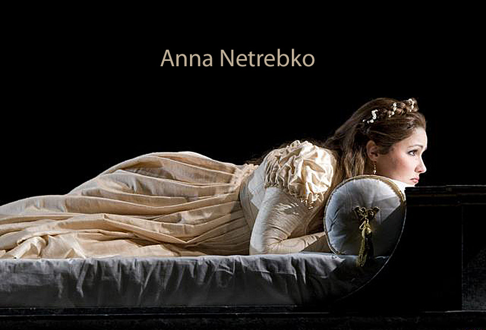
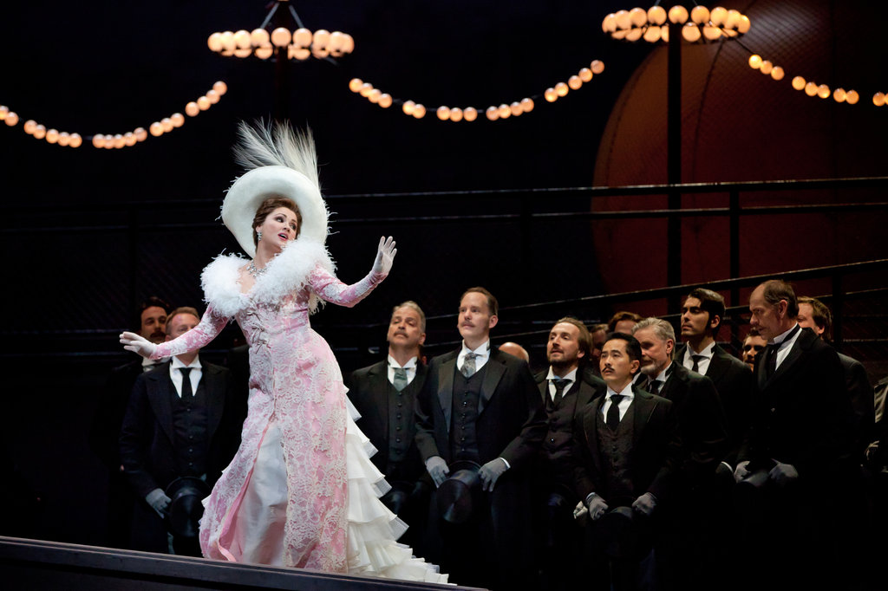

# Anna Netrebko

### ¿Quien es Anna Netrebko ?
**Anna Yúrievna Netrebko, (en ruso, Анна Юрьевна Нетребко; n. 18 de septiembre de 1971 en Krasnodar, Unión Soviética) es una cantante soprano ruso-austriaca. Una de las más importantes sopranos líricas de su generación.**

### Carrera Artistica

Anna Netrebko (Krasnodar, 1971) es una diva extrema ha agotado todas las entradas de la Ópera de Viena.
Comenzó su carrera artística como conserje en el Teatro Mariinski de San Petersburgo (sede de la Ópera Kírov),1 donde llamó la atención del director de orquesta Valeri Guérguiev y en consecuencia se hizo su mentor musical.2 Guiada por Guérguiev, debutó en el Mariinski como Susana en Las bodas de Fígaro. Siguió cantando papeles destacados con la Ópera Kírov, incluyendo Amina en La sonnambula, Pamina en La flauta mágica, Rosina en El barbero de Sevilla, y Lucía Di Lammermoor en Lucia di Lammermoor.
En 1995, con veinticuatro años, debutó en Estados Unidos, como Ludmila, en la ópera de Mijaíl Glinka Ruslán y Liudmila en la Ópera de San Francisco. Después de su exitosa representación, se convirtió en frecuente invitada en San Francisco. También apareció en otras ciudades estadounidenses y es conocida como una aclamada intérprete de papeles operísticos rusos, como Ludmila, Natasha (en Guerra y paz, Louisa en su Boda en el Monasterio y Marfa en La novia del zar.
El timbre y flexibilidad vocal de Netrebko la capacitan para incursionar en el repertorio belcantista y romántico, bajo la guía de Claudio Abbado y en un principio perfeccionándose con clases de la famosa soprano italiana Renata Scotto, especialista en el belcanto, cosechó éxitos como Julietta en I Capuleti e i Montecchi, Gilda en Rigoletto, Musetta y Mimi en La Bohème y Lucia di Lammermoor en la Ópera de Los Ángeles.

### Vida Privada

Anna Netrebko es hija de un ingeniero y de una geóloga. En marzo de 2006, Netrebko solicitó ser ciudadana austriaca, recibiendo su ciudadanía a finales de julio.
De acuerdo con una entrevista en las noticias semanales austriacas, vivirá en Viena y Salzburgo. Esto ha provocado polémica en Rusia.

En el verano de 2007 finalizó su relación con el barítono italiano Simone Alberghini.

En abril de 2008, Netrebko anunció su casamiento con el cantante uruguayo Erwin Schrott, el 5 de septiembre de ese año nació su hijo Tiago, la soprano anunció que el niño padece de una variante de autismo.
La pareja se separó en noviembre de 2013.

En diciembre de 2015 se casó con el tenor azerbaiyano Yusif Eyvázov.

Netrebko vive en San Petersburgo, Viena y Nueva York.

### Anna Netrebko ,más que una Diva.

En esta investigacion que se hizo sobre **Anna Netrebko** se pudó apreciar a una mujer maravillosa y talentosa, entregada en todos los ambitos de su vida.

Es admirable comó con su voz a roto barreras musicales y ha logrado cosas grandiosas y revolucionarias ,ha compartido escenario con personajes muy importantes en el mundo de la opera,y sobre todo ella a estado a la altura de dicho requerimiento. 

>“Me atrevería a decir que es uno de los roles más importantes a los que se puede enfrentar una soprano. Resulta extremadamente arriesgado en tanto que abarca un gran registro y contiene pasajes verdaderamente dramáticos. Necesitas técnica, mucha técnica, y algo más”. -Anna Netrebko en una entrevista .

### Conclusión 
 Podria describirte lo magnifica que es su voz y aunque no seas conocedor de opera ,ella te transporta a algo mágico.
 
 
 La mejor manera es escuchandola (https://www.youtube.com/watch?v=taOTV2UgYY0) ,ha interpretado canciones de Mozart.

